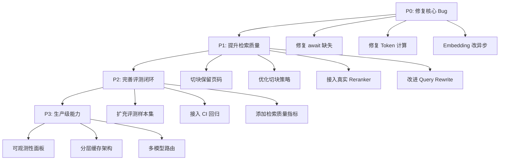

# 多租户 AI SaaS 项目代码深度分析报告

> 本报告基于 **Code Reviewer**、**Backend Architect** 和 **Software Architect** 三个专业视角，对项目代码进行客观、全面的分析。
> 
> 分析时间：2026-03-23

---

## 一、项目总体评价

### ✅ 做得好的地方

| 能力 | 描述 |
|------|------|
| **架构分层清晰** | `api → deps → services → db` 分层合理，API、依赖注入、业务逻辑、数据层各司其职 |
| **Provider 抽象** | LLM、Embedding、Reranker 均采用 Protocol/抽象基类 + 工厂模式，可扩展性好 |
| **延迟初始化** | Storage、Redis、Provider Registry 已做延迟初始化，避免导入阶段副作用 |
| **多租户安全** | RLS（行级安全）+ 组织级隔离 + 配额管理 + API Key 限流，安全基础扎实 |
| **RBAC** | 角色-权限-组织维度三层匹配，满足复杂场景需求 |
| **失败兜底** | 文档入库有完整的失败状态机和兜底日志 |
| **测试覆盖** | 28+ 测试用例覆盖了 RAG 主链路关键节点 |
| **整改文档** | `rag专项整改清单.md` 高度结构化，对技术债务跟踪到位 |

### ⚠️ 总体风险等级：**中高**

项目在原型 → 生产的过渡阶段，主链路已基本可运行，但多处关键环节距离生产级仍有显著差距。

---

## 二、RAG 系统核心问题分析（重点）

### 🔴 P0 - 阻塞级问题

#### 1. Embedding 同步调用阻塞事件循环

**文件**: [embeddings.py](file:///d:/codes/ai/backend/app/services/embeddings.py#L40-L51)

```python
# embed_documents() 和 embed_query() 使用同步 OpenAI 客户端
def embed_documents(self, texts: list[str]) -> list[list[float]]:
    response = self.client.embeddings.create(model=self.model_name, input=texts)
```

**问题**: 在 FastAPI 的异步架构中，[OpenAI](file:///d:/codes/ai/backend/app/services/embeddings.py#28-74)（同步客户端）的 HTTP 调用会**阻塞整个事件循环**。当文档入库时需要 embed 大批文本，将导致所有其他请求被阻塞。

**建议**: 使用 `AsyncOpenAI` 客户端，或在 `asyncio.to_thread()` 中包裹同步调用。

---

#### 2. 文档上传端点缺少 `await` — MinIO 上传

**文件**: [documents.py](file:///d:/codes/ai/backend/app/api/endpoints/documents.py#L28-L32)

```python
minio_url = get_storage_service().upload_file(
    file_bytes=file_bytes,
    filename=file.filename,
    org_id=str(org_id),
)
```

**问题**: [upload_file()](file:///d:/codes/ai/backend/app/services/storage.py#21-40) 是 `async def`，但调用处**未使用 `await`**。这意味着返回的是一个协程对象而非实际 URL，`minio_url` 将保存一个无效的协程引用。

**影响**: 🔴 **写入数据库的 `minio_url` 不是真实 URL**，后续无法正确访问上传的文件。

---

#### 3. Token 计算精确度严重不足

**文件**: [biz/chat.py](file:///d:/codes/ai/backend/app/api/endpoints/biz/chat.py#L101-L110)

```python
tokens_so_far = (len(prompt) + len(full_response)) // 4  # ← 粗暴估算
prompt_tokens = len(prompt) // 4
completion_tokens = len(full_response) // 4
```

**问题**: 对于中文文本，1 个字符 ≈ 1-2 tokens（取决于分词器），而非英文的 ~4 字符/token。中文场景下 Token 计算**偏差可达 3-4 倍**，直接导致：
- 配额耗尽检测不准确
- 计费严重失真
- 流式配额卡断时机错误

**建议**: 复用 [rag_ingestion.py](file:///d:/codes/ai/backend/app/services/rag_ingestion.py) 中已有的 [count_tokens()](file:///d:/codes/ai/backend/app/services/rag_ingestion.py#22-29) 函数，或使用 LLM API 返回的 `usage` 字段。

---

#### 4. 切块不保留页码信息

**文件**: [rag_ingestion.py](file:///d:/codes/ai/backend/app/services/rag_ingestion.py#L94-L107)

```python
chunk = Chunk(
    ...
    chunk_index=i,
    # page_number 未设置！
    embedding=emb,
    ...
)
```

**问题**: `Chunk.page_number` 始终为 `None`。虽然 `DocumentParser` 返回了 `pages` 列表，但 [rag_ingestion.py](file:///d:/codes/ai/backend/app/services/rag_ingestion.py) 完全没有利用 `ParsedDocument.pages` 来计算每个 chunk 属于哪一页。

**影响**: Citation 中的 `page` 字段是空的，前端无法实现「点击引用跳转到原文页码」。

---

### 🔴 P0 - Reranker 用 LLM 替代真实 Reranker

**文件**: [reranker.py](file:///d:/codes/ai/backend/app/services/reranker.py#L54-L110)

```python
class OpenAICompatibleRerankerProvider:
    async def rerank(self, query, results, limit):
        prompt = "You are a retrieval reranker..."
        response = await self.client.chat.completions.create(...)
```

**问题**: 用通用 LLM Chat API 模拟 Reranker 有严重缺陷：
- **延迟过高**: 一次 rerank 需要完整的 LLM 推理，耗时 2-5 秒（专用 reranker < 100ms）
- **性能不稳定**: LLM 不保证严格按要求输出 JSON，解析可能失败
- **成本**: 每次检索都消耗大量 Token
- **准确性**: 通用 LLM 的排序能力远不如专门训练的 cross-encoder

**建议**: 接入 Cohere Rerank、Jina Reranker、或 BGE-Reranker 等专用模型。

---

### 🟡 P1 - 需要优化的问题

#### 5. Query Rewrite 是硬编码规则，不可扩展

**文件**: [query_rewrite.py](file:///d:/codes/ai/backend/app/services/query_rewrite.py#L18-L23)

```python
def rewrite_query(normalized_query: str) -> str:
    rewrites = {
        "这个药还要继续吃吗": "用药是否需要继续",
        "这个药还能继续吃吗": "用药是否需要继续",
    }
    return rewrites.get(normalized_query, normalized_query)
```

**问题**: 只有 2 条硬编码的 rewrite 规则，实际生产中完全不够用。

**建议**:
1. 短期：基于 LLM 做 query rewrite（成本较高但效果好）
2. 中期：构建同义词/近义词表，结合医疗术语词典
3. 长期：训练专用的 query rewrite 模型

---

#### 6. 切块策略过于粗糙

**文件**: [rag_ingestion.py](file:///d:/codes/ai/backend/app/services/rag_ingestion.py#L30-L70)

**当前问题**:
- [_split_with_context()](file:///d:/codes/ai/backend/app/services/rag_ingestion.py#30-47) 按**字符数**切块而非 token 数，不同语言分词精度差异大
- 默认 `chunk_size=800` 字符对中文偏大（约 400-800 tokens，建议 300-500 tokens）
- 重叠区域按字符计算，可能在中文句子中间断开
- 医疗标题正则仅覆盖 15 个固定标题，缺少对「化验结果」「影像报告」「手术记录」等常见医疗文档节的识别
- 没有按句子边界切块的逻辑

**建议**:
```
1. 按句子/段落边界切块
2. 使用 token 数而非字符数控制块大小
3. 扩展医疗标题词典，或使用更灵活的正则/NLP 分句
4. 考虑引入 Contextual Chunking（在每个 chunk 前加全文摘要）
```

---

#### 7. Hybrid 检索缺少权重调整能力

**文件**: [chat.py](file:///d:/codes/ai/backend/app/services/chat.py#L314-L336)

```python
# 向量检索和关键词检索使用完全相同的 RRF 参数
for rank, chunk in enumerate(vector_chunks):
    item.fused_score += 1.0 / (k + rank + 1)
for rank, chunk in enumerate(keyword_chunks):
    item.fused_score += 1.0 / (k + rank + 1)
```

**问题**: 
- 向量检索和关键词检索权重完全相同（都是 1.0），无法调整偏好
- RRF k=60 是固定值，没有实验调优的机制
- 缺少对检索质量的简单度量（如最低分数阈值过滤）

**建议**:
```python
# 支持可配置的权重
vector_weight = settings.RAG_VECTOR_WEIGHT  # default 0.7
keyword_weight = settings.RAG_KEYWORD_WEIGHT  # default 0.3
item.fused_score += vector_weight / (k + rank + 1)  # 向量
item.fused_score += keyword_weight / (k + rank + 1)  # 关键词
```

---

#### 8. 检索缓存策略有安全和性能隐患

**文件**: [chat.py](file:///d:/codes/ai/backend/app/services/chat.py#L62-L81) & [chat.py](file:///d:/codes/ai/backend/app/services/chat.py#L347-L348)

**问题**:
- `query.lower()` 作为缓存键的一部分，但中文无大小写概念，且 `.lower()` 可能破坏部分特殊字符
- 缓存 TTL 固定 3600 秒，没有考虑文档更新后缓存失效
- 文档被删除/更新后，缓存中保存的 chunk_id 可能已不存在（虽然有 `return None` 逻辑处理，但会静默回退到重新检索）
- 没有缓存命中率度量

**建议**:
1. 文档更新/删除时主动清除相关缓存（或缩短 TTL）
2. 添加缓存命中率指标
3. 考虑分层缓存：检索缓存 + 回答缓存

---

#### 9. Conversation Context 追问检测逻辑脆弱

**文件**: [conversation_context.py](file:///d:/codes/ai/backend/app/services/conversation_context.py#L11-L42)

```python
_FOLLOW_UP_MARKERS = ("这个", "这个药", "这个结果", "这个情况", "继续", "还要", "那", "是否")

is_follow_up = any(marker in normalized_current for marker in _FOLLOW_UP_MARKERS) or len(normalized_current) <= 12
```

**问题**:
- 硬编码的标记词覆盖极有限
- `len <= 12` 的判断过于粗暴（「降血压的药有哪些」只有 7 个字，但不是追问）
- 拼接 `recent_user_context + current_query` 是简单字符串拼接，不是语义级别的改写

**建议**: 使用 LLM-based condense（项目中已有 [condense_query()](file:///d:/codes/ai/backend/app/services/chat.py#84-109)），统一用它替代规则型追问检测。

---

#### 10. 流式生成中的数据库操作风险

**文件**: [biz/chat.py](file:///d:/codes/ai/backend/app/api/endpoints/biz/chat.py#L94-L155)

**问题**:
- [generate()](file:///d:/codes/ai/backend/app/api/endpoints/biz/chat.py#94-154) 是在 `StreamingResponse` 的生命周期中执行的，但 `db` session 的作用域由 FastAPI 的 `Depends(get_db)` 管理
- 在 SSE 流结束后才做 `db.add(assistant_msg)` + `db.commit()`，如果客户端中途断开，将**丢失整个回答记录和 Usage 日志**
- `await update_org_quota(db, org_id, ...)` 内部再次调用 `db.commit()`，与外层 `db.commit()` 可能产生事务冲突

**建议**:
1. 即使流中断也要保存部分回答
2. 将 Usage 记录拆分为独立的后台任务
3. 考虑使用独立的数据库 session 做审计写入

---

### 🟡 P1 - 架构级问题

#### 11. ProviderRegistry 线程安全问题

**文件**: [provider_registry.py](file:///d:/codes/ai/backend/app/services/provider_registry.py)

```python
class ProviderRegistry:
    _instance = None
    
    def get_llm(self) -> LLMProvider:
        if self.llm is None:
            self.llm = get_llm_provider()  # 重复创建客户端
        return self.llm
```

**问题**:
- 非线程安全的单例模式（Python 有 GIL 保护，但 `asyncio` 场景下仍可能出现竞态）
- 每次调用 [get_llm()](file:///d:/codes/ai/backend/app/services/provider_registry.py#27-31) 在首次 `None` 时都会创建新客户端，可能存在连接泄漏
- 没有关闭/清理机制

---

#### 12. 依赖残留：langchain 相关库

**文件**: [pyproject.toml](file:///d:/codes/ai/backend/pyproject.toml#L16-L18)

```toml
"langchain-core>=1.2.19",
"langchain-openai>=1.1.11",
"langchain-text-splitters>=1.1.1",
```

**问题**: 代码中已不使用 langchain（embedding 已切到原生 OpenAI 客户端），但 [pyproject.toml](file:///d:/codes/ai/backend/pyproject.toml) 仍保留了 3 个 langchain 依赖，增加了不必要的安装时间和潜在冲突。

---

## 三、非 RAG 部分的关键问题

#### 13. JWT Secret 硬编码

**文件**: [config.py](file:///d:/codes/ai/backend/app/core/config.py#L20)

```python
JWT_SECRET: str = "supersecretkey"
```

🔴 **安全风险**: 默认 secret 硬编码在代码中，如果 [.env](file:///d:/codes/ai/backend/.env) 未设置此变量，将使用此不安全值。建议无默认值，强制通过环境变量设置。

---

#### 14. require_patient_identity 重复查询

**文件**: [deps.py](file:///d:/codes/ai/backend/app/api/deps.py#L99-L130)

两个分支（`user_type != "patient"` 和 `user_type == "patient"`）的查询逻辑完全相同，可以合并。

---

#### 15. 审计日志不提交事务

**文件**: [audit.py](file:///d:/codes/ai/backend/app/services/audit.py#L30-L33)

```python
db.add(log)
# We don't await commit here...
```

如果调用者忘记 `commit`，审计日志将丢失。建议改为独立会话写入或使用事件总线。

---

## 四、优化优先级汇总

### 🔴 P0 - 必须立即修复

| # | 问题 | 影响 | 复杂度 |
|---|------|------|--------|
| 1 | MinIO 上传缺 `await` | 文件 URL 写错 | 低 |
| 2 | Embedding 同步阻塞事件循环 | 入库时整体性能暴跌 | 中 |
| 3 | Token 计算偏差 3-4 倍 | 配额管理完全失真 | 低 |
| 4 | JWT Secret 硬编码 | 安全漏洞 | 低 |

### 🟡 P1 - 下一迭代优先

| # | 问题 | 影响 | 复杂度 |
|---|------|------|--------|
| 5 | 切块不保留页码 | Citation 无法关联原文 | 中 |
| 6 | Reranker 用 LLM 替代 | 延迟高、成本高、准确性差 | 高 |
| 7 | 切块策略粗糙 | RAG 召回质量上限低 | 高 |
| 8 | 流式生成中的 DB 操作风险 | 数据丢失 | 中 |
| 9 | query_rewrite 硬编码 | 检索精度差 | 中 |
| 10 | 追问检测逻辑脆弱 | 多轮对话体验差 | 中 |

### 💭 P2 - 中长期优化

| # | 问题 | 影响 | 复杂度 |
|---|------|------|--------|
| 11 | 检索缓存策略优化 | 一致性+监控 | 中 |
| 12 | 混合检索权重可配置 | 检索质量提升 | 低 |
| 13 | 清除 langchain 残留依赖 | 减小包体积 | 低 |
| 14 | Provider 生命周期管理 | 资源泄漏风险 | 中 |
| 15 | 离线评测样本扩充 | RAG 质量保障 | 高 |

---

## 五、RAG 系统专项优化路线图



---

## 六、总结

本项目在**架构设计理念**上是合理的：Provider 抽象、延迟初始化、多租户安全基础、结构化 Prompt、离线评测框架等方面都体现了较好的工程素养。RAG 整改清单的自述也非常详尽。

但在**实现细节**层面存在多个关键 Bug（如 `await` 缺失、同步阻塞、Token 计算偏差），以及**多处 RAG 核心能力**离生产级还有显著差距（切块策略、真实 Reranker、Query Rewrite、多轮对话压缩、检索质量度量）。

**建议路径**：先修 P0 Bug → 再提升检索质量（切块+Reranker+Query Rewrite）→ 再完善评测闭环和可观测性。
